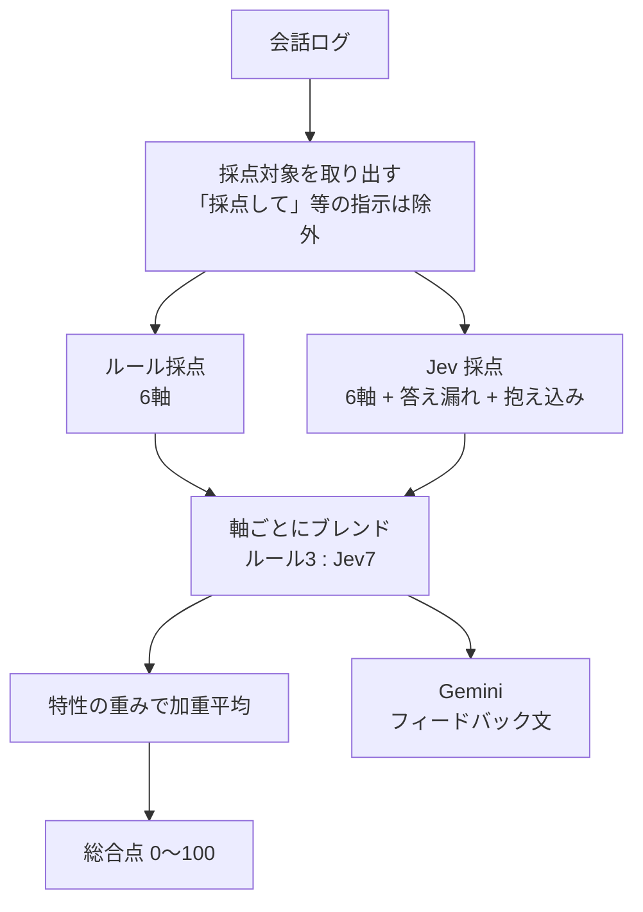
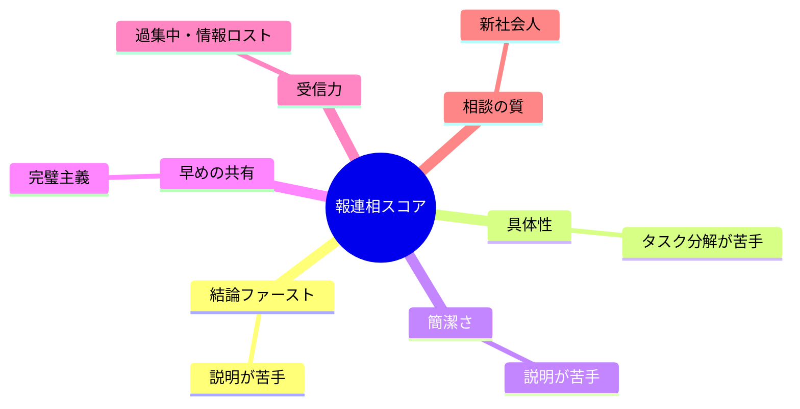
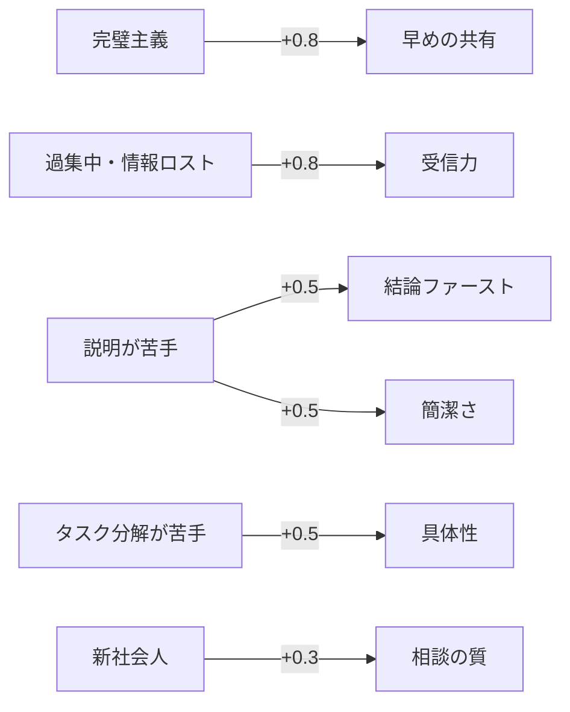
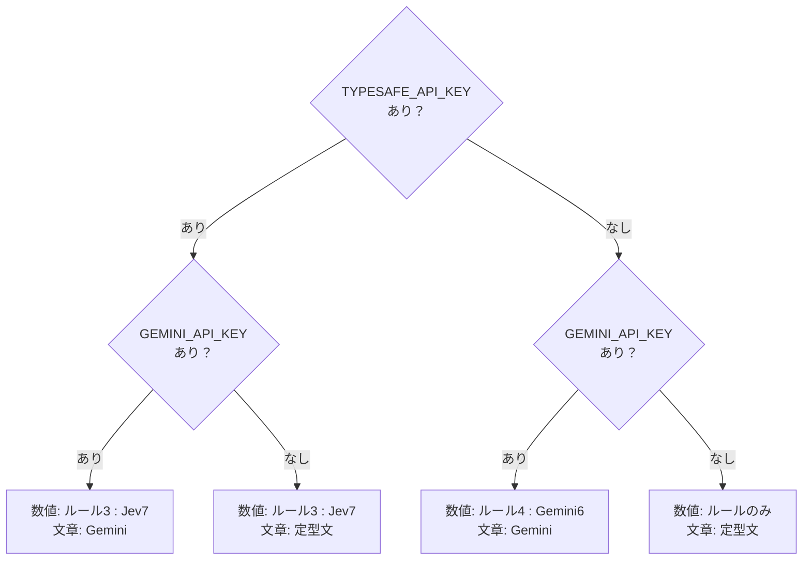
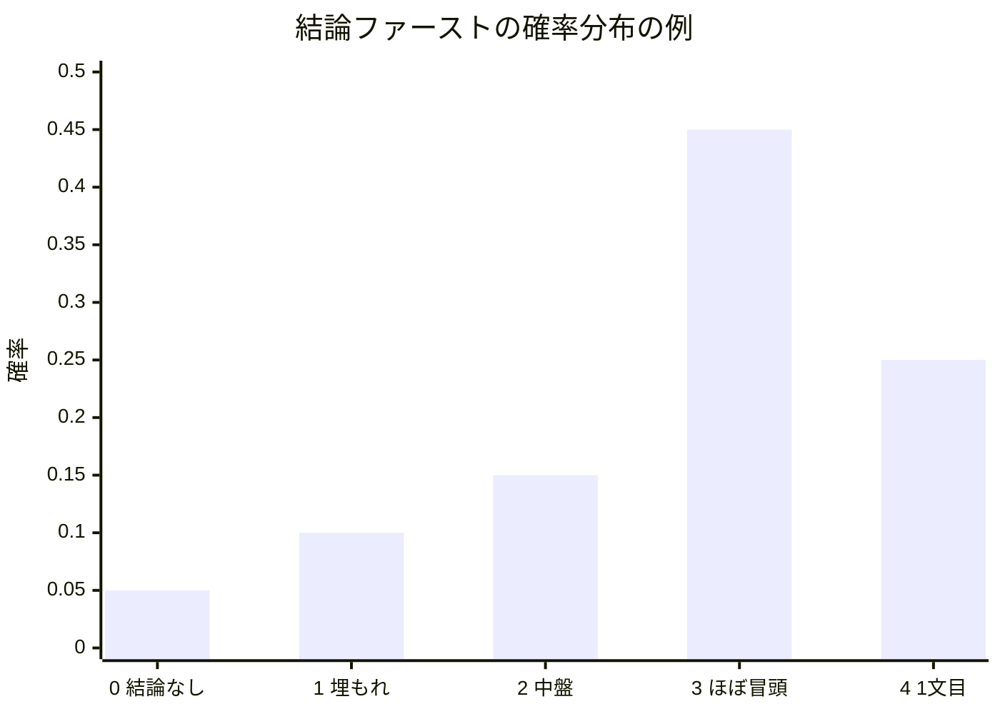

# 採点ルーブリック

> **この資料の結論**: 6つの軸を「ルール3 : Jev7」で採点し、ユーザーの悩みに関係する軸を重くした加重平均を総合点にする。

総合点 = 各軸のスコアを、ユーザー設定（特性）に応じた重みで加重平均したもの。
該当する発言が無い軸（例: 相談していないのに「相談の質」）は `—`（対象外）として平均から外します。

### 図1: 採点の全体像

## 採点軸

### 図2: 6つの軸と、それぞれが助ける悩み

| 軸 | 見ていること | ルールでの判定例 | 悩みとの対応 |
|----|------------|-----------------|------------|
| 結論ファースト | 1文目で結論を言っているか | 1文目に「完了」「遅れ」「相談です」等がある / 1文目が60字以内 / 「えっと」「実は」で始まると減点 | 説明が苦手 |
| 具体性 | 数字・期限・担当・理由があるか | 数字、「明日」「15時」「までに」、担当者、「原因」「ため」 | タスク分解が苦手 |
| 簡潔さ | 1文が長すぎないか | 1文の平均が50字超で減点、全体300字超で減点 | 説明が苦手 |
| 早めの共有 | 抱え込まず途中で出しているか | 「完璧に」「全部終わってから」「自分でなんとか」で減点 / 「現時点」「7割」「一旦」で加点 | 完璧主義 |
| 受信力 | 相手の質問に答えているか | AI の質問のキーワードが次の発言に入っているか | 過集中・情報ロスト |
| 相談の質 | 自分の案と期限を持って相談しているか | 「〜しようと思います」「A案」「どちらが」+ 期限 | 新社会人 |

## 特性による重み

基本の重みは「結論ファースト 1.2、ほかは 1.0」。選んだ特性に応じて下のように加算します。

### 図3: 特性を選ぶと、どの軸が重くなるか

| 特性 | 重くなる軸 |
|------|-----------|
| 完璧主義 | 早めの共有 +0.8 |
| 過集中・情報ロスト | 受信力 +0.8 |
| 説明が苦手 | 結論ファースト +0.5 / 簡潔さ +0.5 |
| タスク分解が苦手 | 具体性 +0.5 |
| 新社会人 | 相談の質 +0.3 |

**計算例**（「過集中」を選んだ人。相談は無し）

| 軸 | スコア | 重み | スコア×重み |
|----|------:|----:|-----------:|
| 結論ファースト | 80 | 1.2 | 96 |
| 具体性 | 70 | 1.0 | 70 |
| 簡潔さ | 90 | 1.0 | 90 |
| 早めの共有 | 70 | 1.0 | 70 |
| 受信力 | 20 | **1.8** | 36 |
| 相談の質 | — | — | （対象外） |
| **合計** | | 6.0 | 362 |

総合点 = 362 ÷ 6.0 ≒ **60点**。特性を選ばなければ受信力の重みは 1.0 で、(96+70+90+70+20)÷5.2 ≒ 67点。
**苦手な軸ほど総合点に響く**ので、何を伸ばせばいいかがはっきりします。

## スコアの作り方

### 図4: 使える API によって、採点のしかたが切り替わる

| 使える判定器 | 数値 | 文章フィードバック |
|-------------|------|-------------------|
| ルール + Jev + Gemini | ルール 3 : Jev 7 | Gemini（点数は付け直させない） |
| ルール + Jev | ルール 3 : Jev 7 | 定型文 |
| ルール + Gemini | ルール 4 : Gemini 6 | Gemini |
| ルールのみ | ルール | 定型文 |

- **ルール**: 決定的でブレない。キーワードでしか判断できないのが弱点
- **Jev**: 5段階ルーブリックの確率分布から期待値を出す。文脈を読めて、しかも揺れにくい。数値の主役
- **Gemini**: 文脈を読めるが、点数は毎回少し揺れる。Jev があるときは文章づくりに専念させる
### 図5: Jev の score を点数に換算する例

Jev は5段階（0〜4）のどれに当たるかを**確率の分布**で返します。その期待値を 0〜100 に換算します。

期待値 = 0×0.05 + 1×0.10 + 2×0.15 + 3×0.45 + 4×0.25 = **2.75** → 2.75 ÷ 4 × 100 ≒ **69点**

「3か4のどちらか」で迷っている、という**迷い具合まで点数に反映**されるのが、LLM に点数を直接聞く方法との違いです。

- 「質問に答えていない」「抱え込み」の注意点は、Jev があれば Jev の判定、無ければルールの判定を必ず表示します

## 既知の限界

- ルールは日本語のキーワード一致なので、言い回しを変えると取りこぼす（例: 「片付きました」は完了と判定されない）。Gemini 併用時は文脈で補正されます
- Jev が無いとき、受信力は「質問の単語が答えに含まれるか」で見ているため、別の言葉で答えると答え漏れ扱いになることがあります（Jev があれば文脈で判定）
