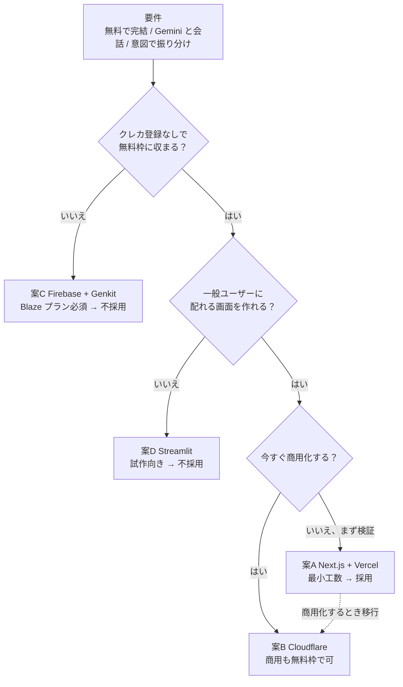
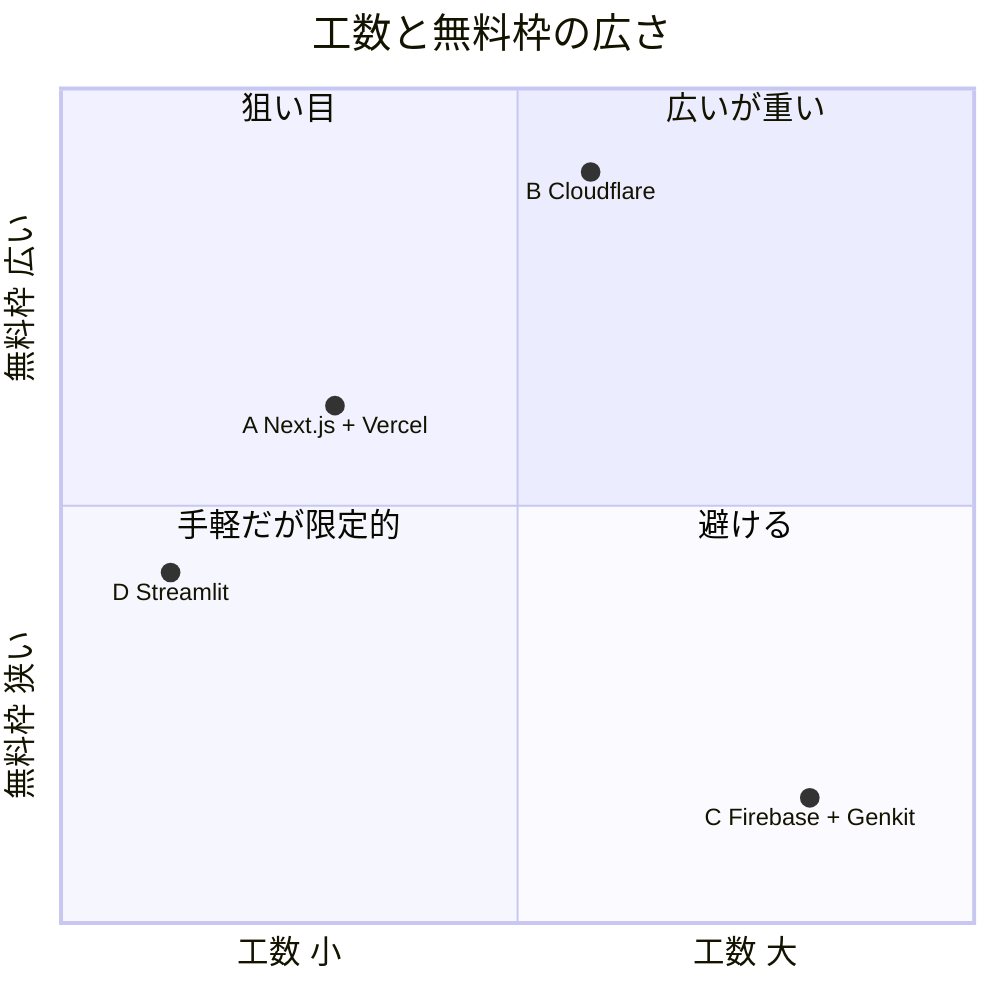
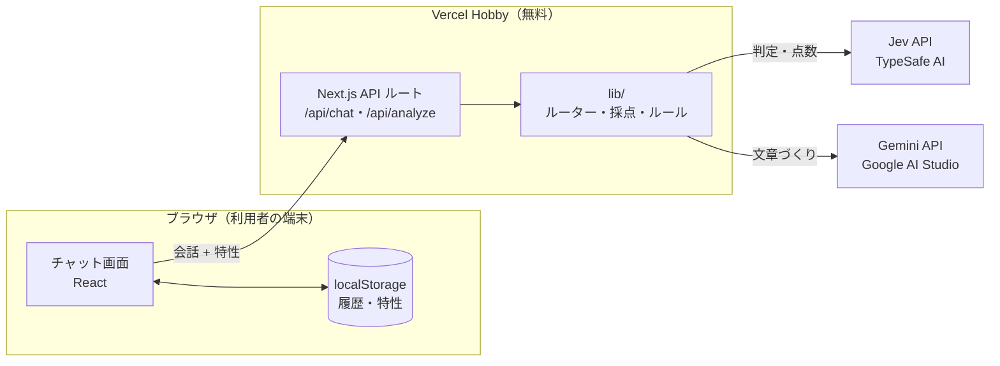
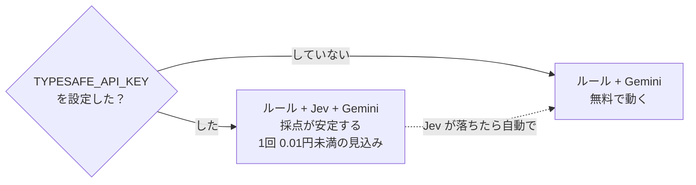

# 技術選定: 候補比較と決定

> **この資料の結論**: まずは **案A（Next.js + Vercel + Gemini）** で最短で作り、判定・数値化は **Jev** に任せる。商用化するときは **案B（Cloudflare）** へ移す。

## 前提条件（選定の物差し）

| # | 条件 | 理由 |
|---|------|------|
| 1 | **無料枠だけで運用が回る** | 個人開発・検証フェーズ。課金登録（クレカ必須プラン）も避ける |
| 2 | **アプリ内で Gemini と会話する** | 要件。Google AI Studio の無料 API キーで使える |
| 3 | **意図判定 → 処理の振り分け**ができる | 報告・連絡・相談・タスク分解・採点で処理が違う |
| 4 | **LLM 出力を型で縛れる** | スコアは数値。自由文のままだと画面が壊れる |
| 5 | **少ない工数で作り切れる** | まず使って、フィードバックを得るのが最優先 |

### 図1: 選定の考え方（条件で候補をふるい落とす）

---

## 候補

### 案A: Next.js（Vercel Hobby）+ Gemini API + 端末内保存 ← **採用（最小工数プラン）**

| 項目 | 内容 |
|------|------|
| 構成 | Next.js App Router（画面 + API ルート）/ `@google/genai` / zod / localStorage |
| 無料枠 | Vercel Hobby（個人・非商用）、Gemini API 無料枠 |
| メリット | 1リポジトリ・1言語（TS）で画面とAPIが完結。API キーをサーバー側に隠せる。Gemini の JSON Schema 出力を zod で型検証でき、条件4を満たす。DB を持たないので運用ゼロ |
| デメリット | Vercel Hobby は**商用利用不可**。履歴は端末内のみ（機種変更で消える・複数端末で共有できない）。サーバーレスなので長時間処理は不向き |

### 案B: Cloudflare Workers/Pages + Hono + D1 + Gemini API

| 項目 | 内容 |
|------|------|
| 無料枠 | Workers 10万リクエスト/日、D1（SQLite）無料枠あり。**商用利用も可** |
| メリット | 無料枠が最も広く、商用化しても同じ構成で続けられる。D1 で履歴をサーバー保存できる。コールドスタートがほぼ無い |
| デメリット | Node.js API と完全互換ではない（ランタイム差の調査コスト）。認証を自前で足す必要があり、その分工数が増える |

### 案C: Firebase（Hosting + Cloud Functions + Firestore）+ Genkit

| 項目 | 内容 |
|------|------|
| メリット | Google 製で Gemini との親和性が最も高い。Genkit の Flow で「振り分け」を宣言的に書ける。Firebase Auth で認証も簡単 |
| デメリット | **Cloud Functions / App Hosting は従量課金の Blaze プラン（クレカ登録）が必須**。無料範囲内で使えても「無料枠で完結」の条件1を満たさない。構成要素が多く学習コストが高い |

### 案D: Streamlit Community Cloud（Python）+ Gemini API

| 項目 | 内容 |
|------|------|
| メリット | 最速でプロトタイプが作れる。Python だけで完結 |
| デメリット | UI の自由度が低い（スマホでの使い勝手が弱い）。無料枠はスリープする。一般ユーザーに配る段階で作り直しになりやすい |

---

## 比較表

### 図2: 工数と無料枠の広さ（左上ほど「手軽で長く無料」）

案A は「無料枠の広さ」では案B に負けますが、工数の小ささで上回ります。**検証フェーズでは工数を優先**し、商用化のタイミングで右上（案B）へ移る計画です。

| 観点 | A: Next.js + Vercel | B: Cloudflare | C: Firebase + Genkit | D: Streamlit |
|------|:---:|:---:|:---:|:---:|
| 無料枠で完結 | ◯（非商用） | ◎（商用可） | ✕（Blaze 必須） | ◯ |
| Gemini 連携の書きやすさ | ◯ | ◯ | ◎ | ◯ |
| 振り分け（ルーター）の実装 | ◯ 自前 | ◯ 自前 | ◎ Genkit Flow | ◯ 自前 |
| 初期工数 | **小** | 中 | 大 | 最小 |
| UI・スマホ対応 | ◎ | ◯ | ◎ | △ |
| 将来の拡張（DB・認証） | ◯ Supabase 追加 | ◎ D1 追加 | ◎ | △ |

## 決定

**案A を採用**し、「作って使ってもらう」までの時間を最短にします。

- 決め手は「**無料で・一番早く・型安全に**」の3点がそろうこと
- 振り分けは Genkit のようなフレームワークに頼らず、**ルール → Jev → Gemini の段階ルーター**を自前で書きました（`lib/router.ts`）。依存が少なく、仕組みを自分で説明できることを優先しています
- 商用化するときは **案B（Cloudflare）へ移す**のが第一候補です。`lib/` はフレームワークに依存しない純粋な TS にしてあるので、`app/api/*` を Hono に書き換えるだけで移せます

## 確定した技術仕様

### 図3: システム構成（どこで何が動くか）

- API キーはサーバー（Vercel）側だけに置き、ブラウザには渡しません
- 会話ログはサーバーに保存せず、利用者の端末（localStorage）にだけ残します

| レイヤー | 採用技術 | 備考 |
|---------|---------|------|
| フロント + API | Next.js 16（App Router）/ React 19 / TypeScript | |
| 判定モデル | Jev（`@typesafe-ai/sdk`）既定 `jev-latest` | 意図の振り分け・スコア・答え漏れ判定。任意（無くても動く） |
| LLM | Gemini API（`@google/genai`）既定 `gemini-2.5-flash` | 文章づくり担当。`GEMINI_MODEL` で変更可。無料枠の対象モデル・上限は変わるので AI Studio で確認 |
| 出力の型検証 | zod v4（`z.toJSONSchema` → `responseJsonSchema`） | LLM の出力を zod で検証。不一致なら安全側にフォールバック |
| 採点 | ルール 3 : Jev 7（Jev が無ければ ルール 4 : Gemini 6） | どの API が無くてもルールだけで動く。詳細は [scoring.md](scoring.md) |
| 保存 | localStorage（端末内） | 職場の会話ログを外部に持ち出さない |
| テスト | Vitest | API キー無しで全テストが通る |
| CI | GitHub Actions | 公開リポジトリは無料 |
| ホスティング | Vercel Hobby | 環境変数に `GEMINI_API_KEY` と `TYPESAFE_API_KEY` を設定するだけ |

## Jev の採用判断

「判定・数値化」の担当として Jev（TypeSafe AI の System One モデル）を組み込みました。

| 候補 | メリット | デメリット |
|------|---------|-----------|
| **Jev（採用）** | 選択・段階評価・はい/いいえを確率つきで返す。LLM より揺れにくく速い。出力トークン無料 | 早期アクセス制でキー入手に待ちがある。無料枠の有無が未確認。会話を外部に送る先が増える |
| Gemini だけで判定 | 追加サービス不要・無料枠で完結 | 点数が毎回揺れる。確信度が取れない |
| ルールだけで判定 | 無料・決定的 | 言い換えに弱い |

### 図4: Jev を入れても「無料で動く状態」は残る

**無料枠との関係**: Jev のキーは任意です。未設定なら「ルール + Gemini」で今までどおり無料で動きます。
Jev の料金は入力 $0.042/100万トークン・出力無料と報じられており、1回の採点（数千トークン）あたり 0.01 円未満の見込みです。

## 注意点（必ず知っておくこと）

- **Gemini API の無料枠では、入力内容が Google のサービス改善に使われる場合があります。** 実在の顧客名・社外秘情報は入力しないよう画面と README で案内しています。業務で本格的に使う場合は有料枠（データが学習に使われない）へ切り替えてください
- **`TYPESAFE_API_KEY` を設定すると、会話内容が TypeSafe AI にも送信されます。** 規約とデータの扱いを確認してください
- 無料枠のリクエスト上限を超えると 429 エラーになります。ルーターが「ルールで決まる時は Gemini を呼ばない」設計なのは、この枠を節約するためです
